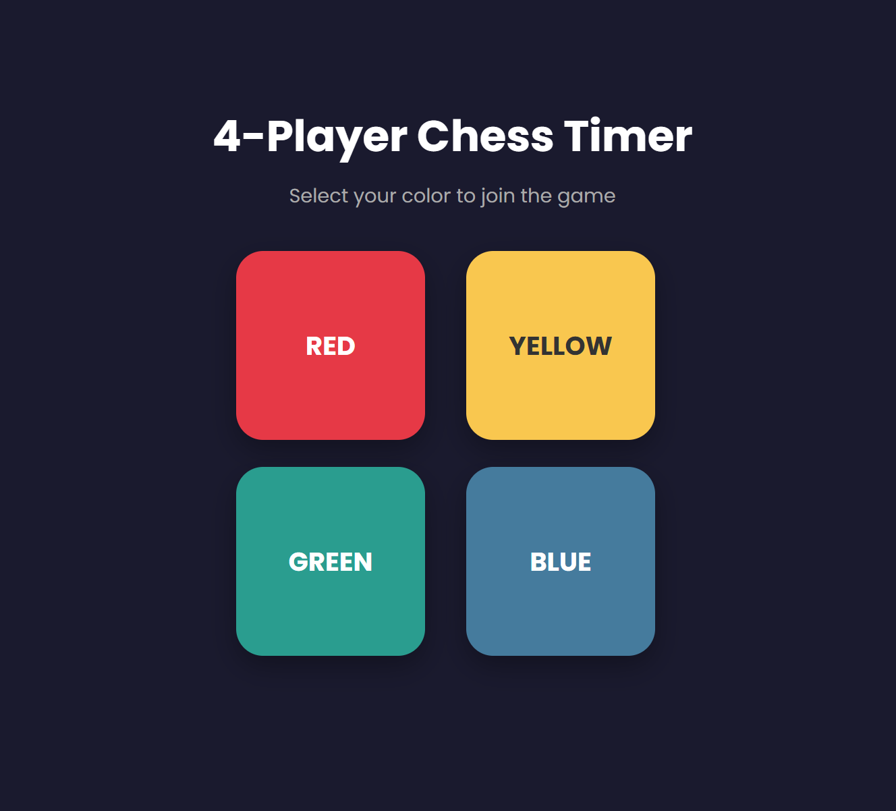
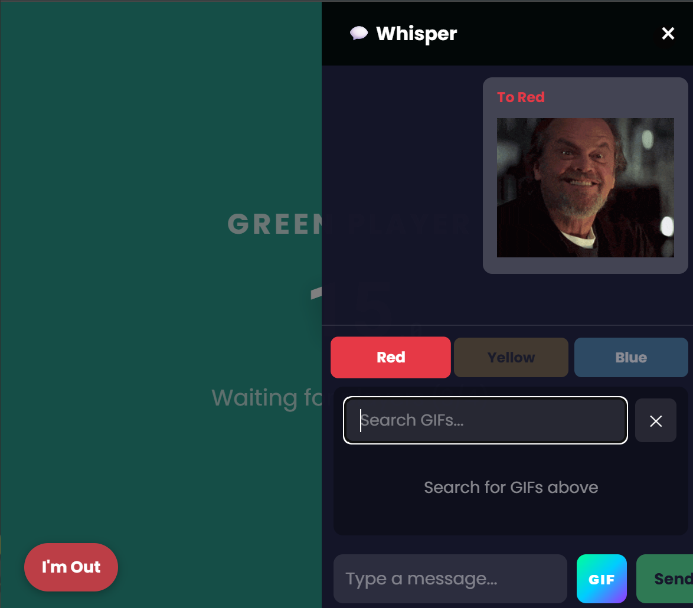
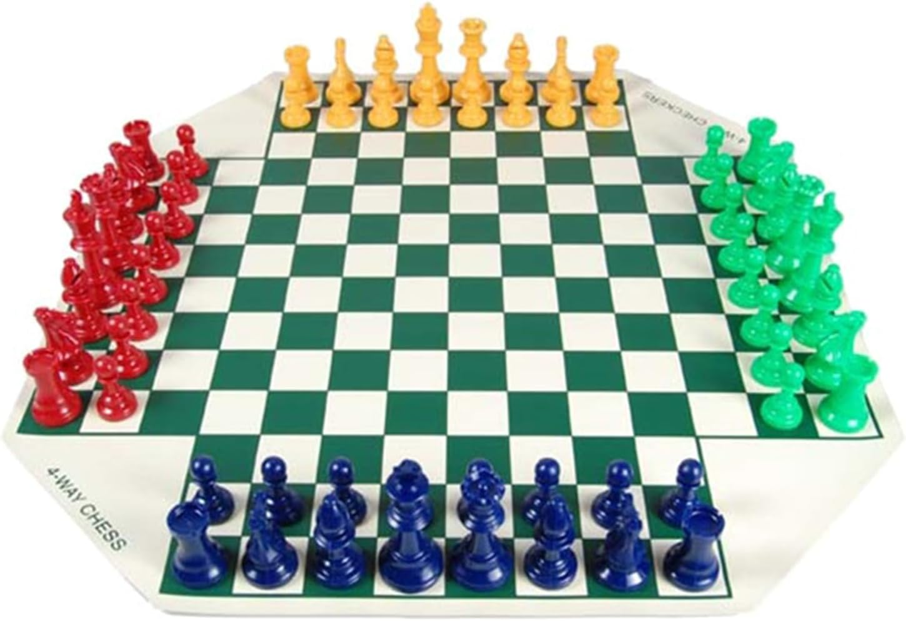

# 4-Player Chess Timer

A real-time multiplayer chess timer for 4-player chess games. Players connect from their phones or devices and take turns, with automatic turn switching and elimination tracking.

 

## Recommended Chess Set

For the best 4-player chess experience, we recommend this chess set from Amazon:

<a href="https://amzn.eu/d/0htUVIDu">
  
</a>

[Buy on Amazon](https://amzn.eu/d/0htUVIDu)

## Features

- **4 Player Support** - Red, Yellow, Green, Blue players
- **Real-time Sync** - All players see timer updates instantly via WebSockets
- **Millisecond Precision** - Timer displays down to 100ms
- **Auto-elimination** - Players are eliminated when their timer runs out
- **Manual Elimination** - "I'm Out" button for checkmates/resignations
- **Reconnection** - Players can reconnect if disconnected mid-game
- **Private Chat** - Whisper messages between players during the game
- **Per-Conversation Threading** - Chat messages organized by player with unread badges
- **GIF Support** - Send GIFs via Giphy integration in chat
- **Host Controls** - Pause/resume and stop/reset game from server console or by pressing 'r' on the game over screen

## Installation

1. **Install Node.js** (v18 or higher recommended)

2. **Clone or download** this repository

3. **Install dependencies:**
   ```bash
   npm install
   ```

## Running the App

```bash
node app.js
```

The server starts on port 80. Access it at:
- **Local machine:** http://localhost
- **Other devices on network:** http://[YOUR_IP_ADDRESS]

To find your IP address:
- **Windows:** `ipconfig` (look for IPv4 Address)
- **Mac/Linux:** `ifconfig` or `ip addr`

> **Note:** Port 80 may require administrator/root privileges. Run as admin or modify the port in `app.js` if needed.

## How to Play

1. **Join the Game** - Each player opens the app and selects their color (Red, Yellow, Green, Blue)

2. **Wait for Players** - Game starts automatically when 2 players have joined (configurable via `PLAYERS_REQUIRED` in app.js)

3. **Take Turns** - When it's your turn:
   - Your screen shows the active indicator
   - Make your move on the physical chess board
   - Tap anywhere on screen to end your turn

4. **Elimination** - Players are eliminated when:
   - Their timer runs out (automatic)
   - They tap "I'm Out" (checkmate/resignation)

5. **Game Over** - Game ends when only one player remains

## Configuration

Edit these constants at the top of `app.js`:

```javascript
const TIMER_SECONDS = 15;       // Seconds per turn
const PLAYERS_REQUIRED = 4;     // Players needed to start (2-4)
const CHAT_ENABLED = true;      // Enable whisper chat feature
```

## Chat Feature

- Tap the chat button (💬) to open the chat panel
- Select a recipient to send private messages
- Messages are only visible to sender and recipient
- **Per-conversation view** - Click a player button to see only messages with that player
- **Unread badges** - Recipient buttons show unread message count
- **GIF support** - Tap the GIF button to search and send GIFs via Giphy

## Host Controls

- **Pause/Resume:** Host can pause and resume the game from the server console.
- **Reset/Stop Game:** When the game is over, press the **'r'** key to reset or stop the game. The previous click-to-restart and 's' key are replaced by this keyboard shortcut.

These controls are only available on the host machine running the server.
